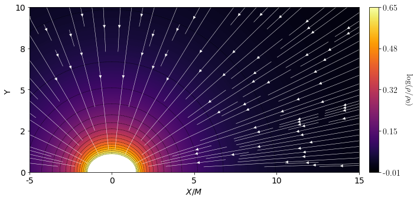
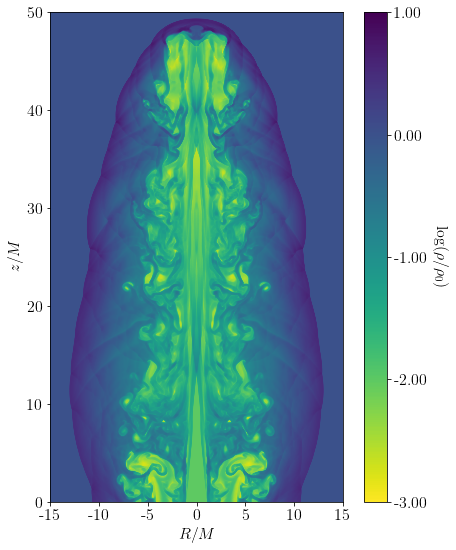

```python
from aztekasPlot.main import Plotter
import numpy as np
```


```python
plot = Plotter("./kerr-schild.dat",metric="Kerr-Schild",a_spin=0.99)
```


```python
plot.initialize_plot(fontsize=14)
plot.set_axis(x1min=-5,x2min=0,x1max=15,x2max=10,X2_reflect=True)
plot.set_axis_ticks()
plot.set_axis_labels(x1_label="$X/M$")
plot.get_contour_plot(plot_var="rho",
                      cmap='inferno',
                      contour_color='black',
                      scale='log',
                      cbar_min = -0.01,
                      cbar_max = None,
                      set_contour = True
)
plot.get_colorbar(bar_width=3,cbar_pad = 0.06, cbar_label="$\\log(\\rho/\\rho_0)$",labelpad=22)
plot.get_streamlines()
```





```python
plot = Plotter("./mink_cyl.dat")
```


```python
plot.initialize_plot(figsize=(10,9),fontsize=16)
plot.set_axis(X2_reflect=True)
plot.set_axis_labels(x1_label="$R/M$", x2_label="$z/M$")
plot.set_axis_ticks(x1_ticks=[-15,-10,-5,0,5,10,15],x2_nticks=6)
plot.data_dict["flux"] = plot.data_dict["rho"]*plot.data_dict["vv"] + 0.0000000001
plot.get_contour_plot(plot_var="rho",
                      cmap='viridis_r',
                      contour_color='black',
                      scale = 'log',
                      cbar_min = -3,
                      cbar_max = 1,
                      set_contour=False,
                      cbar_extend="neither"
                     )
plot.get_colorbar(bar_width=8,cbar_pad = 0.15, cbar_label="$\\log(\\rho/\\rho_0)$",labelpad=22)
```




```python
plot.save_figure("plot.png")
```
